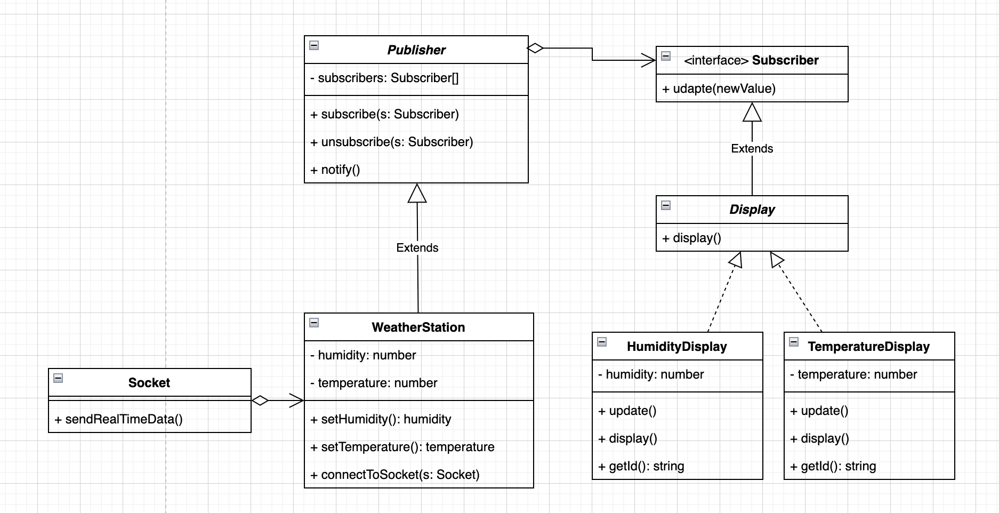

## Estación meteorológica

Tenemos que crear una aplicación para una estación meteorológica. Desde diferentes puntos de una ciudad recibiremos datos en tiempo real a través de un Socket de los diferentes dispositivos de Humedad y Temperatura.

Los datos se mostrarán en dos diferentes displays, uno para humedad y otro para temperatura.

Diseña e implementa el sistema. Para simular los datos en tiempo real podéis crear una entidad que genere datos nuevos cada segundo con `setInterval`, simulando ser el socket

La humedad se mide en % y la temeratura en ºC

## UML diagram

