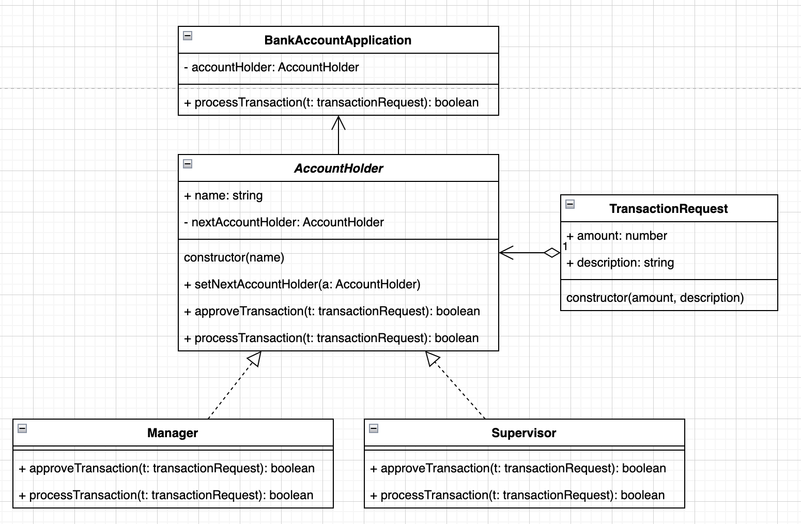

## Banking

Create a program that simulates a chain of bank account holders. Each account holder can approve or reject a transaction request. The transaction request should be passed through the chain of accounts starting with the first account holder. If the first account holder approves the request, it should be passed on to the next account holder in the chain. If the first account holder rejects the request, the process should stop and the request should not be passed on to any other account holders.

- Step 1: Create a base class "AccountHolder" with the following properties:

  name (string)
  nextAccountHolder (AccountHolder)

- Step 2: Create a class "TransactionRequest" with the following properties:

  amount (float)
  description (string)

- Step 3: Create a method "approveTransaction" in the AccountHolder class that takes in a TransactionRequest as a parameter. The method should return a boolean indicating whether the transaction was approved or rejected.

- Step 4: Create two subclasses of AccountHolder: "Manager" and "Supervisor". Both classes should inherit from the AccountHolder class and override the "approveTransaction" method. The Manager class should approve transactions under $1000 and the Supervisor class should approve transactions under $5000.

- Step 5: Create a "main" method that creates a chain of account holders: AccountHolder1 (Manager) -> AccountHolder2 (Supervisor) -> AccountHolder3 (Manager).

- Step 6: Create a TransactionRequest object and pass it through the chain of account holders starting with AccountHolder1. Print out whether the transaction was approved or rejected by each account holder in the chain.

- Step 7: Test the program by passing in a transaction request with an amount of $1500 and verify that it is approved by AccountHolder1 and AccountHolder3 but rejected by AccountHolder2.

## UML diagram

